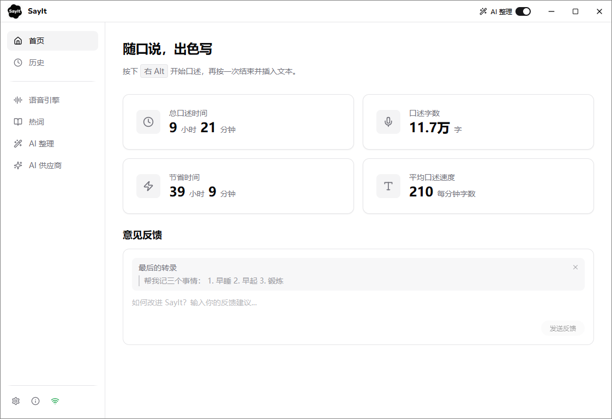

<div align="center">


# SayIt

**随口说，出色写 — 用说话代替打字，AI 实时把口语变成书面表达。**

按下快捷键开始说话，再按一次，润色后的文字自动输入到光标位置。

[](./LICENSE)
[](https://github.com/crosswk/SayIt/releases)

**[下载客户端](https://github.com/crosswk/SayIt/releases/latest)** · **[网页版体验](https://sayitapp.site)** · **[配置文档](docs/)**

**视频介绍：[我做了一个开源 AI 语音输入法——SayIt](https://www.bilibili.com/video/BV1JLTs6REPU/)**（B 站）

</div>

---

<div align="center">



*主界面 — 统计数据与快捷操作*

<br>


*外观配置 — 多主题切换与悬浮窗自定义*

<br>


*诊断面板 — 实时运行状态与连接检测*

</div>

---

## 为什么做 SayIt

在 AI 时代，模型的输出 Token 速度越来越快，人却受限于打字速度。特别是和 AI 对话时，说话是非常自然和高效的方式。

我最开始用的是 Typeless，体验确实很好，Typeless 也开启了全民 VibeCoding 语音输入法的时代😁。但用了一段时间发现：价格太贵，AI 润色的 Prompt 不能自定义，有时候我并不想要那么格式化的整理，Typeless 的 AI 整理功能相对激进。

看了一下市面上其他 VibeCoding 出来的语音输入工具，大部分都是个人使用为主，很少有面向团队和企业内部使用的。所以我想做一个既适合个人使用，又可以给团队和企业内部部署的语音输入工具——Prompt 完全可控，部署方式灵活，数据流向透明。

语音输入的核心就两个技术：**语音识别（ASR）** 和 **AI 文本润色**。我基本上测试了市面上开源和闭源的各大语音识别模型，个人大体排名是：

> **豆包 > Typeless ≈ Qwen3-ASR > FunASR-Nano2512 >= FireRedASR2 > Whisper**

中文语音识别，豆包实际测试效果非常好，用手机上的豆包输入法就能很好地感受出来。豆包悄悄话的识别是断层领先的——我很多场景都是小声说话，毕竟工位上也不太好和 AI 大声聊天。

SayIt 后端部署使用的是 Qwen3-ASR，效果仅次于豆包，开源模型里算是最好的选择。如果是自己部署后端在公司内部使用，我使用 vLLM 为 Qwen-ASR 的推理速度做了优化，能够更快的进行推理识别。

> 我大大低估了 VibeCoding 想要产品化的难度。这个软件最初的形态大概 2~3 天就弄出来了，但想要公开给大家使用，耗费了 x50 倍的时间和精力。软件叫什么名字、Logo 怎么设计、前端样式是否好看、用户如何提交反馈、如何捕获报错信息、服务器端多用户多并发、如何加快识别速度……每一个场景都是可以持续优化。

这是一个开源项目，我没有准备用它盈利。做这个纯粹是我个人对语音输入的需求很强，而且现在 AI 极大地放大了个人的能力。如果你觉得这个产品好用，可以点一个 ⭐ Star，这会激励我继续维护这个项目，或者在软件主页给我反馈。

## 下载使用

**大部分用户直接下载客户端即可，无需任何配置。**

[下载 Windows 安装包](https://github.com/crosswk/SayIt/releases/latest)

安装后默认连接我提供的公共服务器，开箱即用。服务器端的 AI 使用的是 Groq 提供的 OpenAI 120B 模型，会有免费的请求限制。

也可以先通过 [网页版 Demo](https://sayitapp.site) 快速体验 ASR 的识别速度和效果，无需安装任何东西。

## 使用模式

| 模式 | 适合谁 | 需要什么 |
|------|--------|---------|
| **服务器模式**（默认） | 快速体验 | 无需配置，连接公共服务器 |
| **云 API 模式** | 个人用户长期使用 | 自己的 ASR + AI API Key |
| **自部署服务器** | 团队 / 企业内部 | 一台带 GPU 的服务器 |

### 服务器模式（默认）

下载即用。客户端默认连接公共体验服务器，适合快速感受效果。

### 云 API 模式（推荐个人用户）

不需要服务器，客户端直接调用云端服务。对于个人用户来说：

- **语音识别**：申请一个豆包 ASR API 就能获得最好的中文识别效果
- **AI 润色**：推荐 DeepSeek deepseek-v4-flash，速度快价格便宜

每月成本约几元钱。详见配置文档：
- [语音识别配置](docs/SayIt%20语音识别配置.md)
- [AI 润色供应商配置](docs/SayIt%20AI%20润色供应商配置.md)

### 自部署服务器（团队 / 企业）

适合对数据隐私有要求、或需要内网部署的场景。使用 Qwen3-ASR 1.7B 模型在 GPU 服务器上进行本地推理：

```bash
git clone https://github.com/crosswk/SayIt.git
cd SayIt/server
cp config.example.yaml config.yaml
cp .env.example .env
# 编辑 .env 填入配置

# Docker 部署（推荐）
docker compose up -d --build

# 或直接运行
pip install -r backend/requirements.txt
cd backend && uvicorn app.main:app --host 0.0.0.0 --port 8000
```

需要 NVIDIA GPU（≥16GB 显存）。

#### ASR 性能参考

测试环境：AWS EC2 g5.xlarge（NVIDIA A10G 24GB, 4 vCPU, 16GB RAM），模型 Qwen3-ASR-1.7B + vLLM 推理。

| 音频时长 | ASR 延迟 | RTF |
|---------|---------|-----|
| 30s | ~0.8s | 0.025 |
| 1 min | ~1.6s | 0.026 |
| 2 min | ~2.1s | 0.017 |
| 3 min | ~2.5s | 0.014 |
| 5 min | ~3.0s | 0.010 |

## 功能特性

- **全局语音输入** — 在任何应用中按下快捷键即可口述，文字自动插入光标位置
- **AI 智能润色** — 口语自动转书面语，去口癖、纠错、分段，Prompt 完全可自定义
- **多种语音识别** — 豆包 ASR、千问 ASR，以及本地离线识别（SenseVoice、Qwen3-ASR，基于 sherpa-onnx）
- **热词增强** — 自定义专业术语词表，提升识别准确率
- **悬浮窗反馈** — 录音状态、波形动画、处理进度实时可见
- **历史记录** — 所有转录结果本地保存，支持搜索和收藏
- **隐私可控** — 支持完全自部署，数据流向透明

## 项目结构

```
SayIt/
├── client/                   # 桌面客户端（Tauri + React + Rust）
│   ├── src/
│   │   ├── components/       # 通用 UI 组件
│   │   ├── features/        # 功能模块（设置、自动更新）
│   │   ├── overlay/          # 悬浮窗（独立窗口，波形动画）
│   │   ├── pages/            # 页面（首页、历史、设置）
│   │   ├── services/         # 核心服务（录音、转写、存储）
│   │   └── types/            # TypeScript 类型定义
│   └── src-tauri/
│       └── src/              # Rust 后端（键盘钩子、系统集成、SQLite）
├── server/                   # 后端服务（FastAPI + GPU 推理）
│   ├── backend/app/          # FastAPI 应用（ASR、LLM、WebSocket、Admin）
│   ├── gateway/              # HTTPS 反向代理（Node.js）
│   ├── web/                  # 网页版（落地页、Demo、Admin 面板）
│   ├── prompts/              # LLM 提示词 + 热词
│   ├── releases/             # 客户端安装包 + 自动更新配置
│   ├── docker-compose.yml    # 一键部署
│   └── config.example.yaml   # 配置模板
└── docs/                     # 用户文档
```

## 技术栈

| 层　　　　　　 | 技术　　　　　　　　　　　　　　　　　　　　　　　　 |
| ----------------| ------------------------------------------------------|
| 桌面客户端　　 | Tauri v2、React、TypeScript、Tailwind CSS　　　　　　|
| 客户端系统集成 | Rust（全局键盘钩子、剪贴板、SQLite）　　　　　　　　 |
| 后端服务　　　 | Python、FastAPI、WebSocket　　　　　　　　　　　　　 |
| 语音识别　　　 | Qwen3-ASR + vLLM / 豆包 ASR / 千问 ASR / sherpa-onnx |
| AI 润色　　　　| DeepSeek / 通义千问 / Azure OpenAI / Ollama　　　　　|
| 部署　　　　　 | Docker Compose、NVIDIA Container Toolkit　　　　　　 |
| 开发　　　　　 | 整个项目使用 Claude Opus 开发　　　　　　　　　　　　|

## 开发

### 客户端

```bash
cd client
npm install
npm run tauri dev
```

前置要求：Node.js 18+、Rust 1.75+

### 服务端

```bash
cd server
python3 -m venv .venv && source .venv/bin/activate
pip install -r backend/requirements.txt
cd backend && uvicorn app.main:app --port 8000
```

前置要求：Python 3.10+、NVIDIA GPU + CUDA

## 交流反馈

关注微信公众号获取更新动态，或扫码加入用户反馈微信群一起交流：

<div align="center">

<table>
<tr>
<td align="center"><br>微信公众号</td>
<td align="center"><br>用户反馈群</td>
</tr>
</table>

</div>

## 贡献

欢迎提交 Bug 报告和功能建议！请阅读 [贡献指南](./CONTRIBUTING.md)。

## Contributors

<!-- ALL-CONTRIBUTORS-LIST:START -->
| [<br><sub>crosswk</sub>](https://github.com/crosswk) | [<br><sub>Claude (Anthropic)</sub>](https://claude.ai) |
|:---:|:---:|
<!-- ALL-CONTRIBUTORS-LIST:END -->

## 许可证

[GNU Affero General Public License v3.0](./LICENSE)

你可以自由使用、修改和自部署 SayIt。如果你分发修改版本或将其作为网络服务运行，需要以相同许可证公开源代码。
